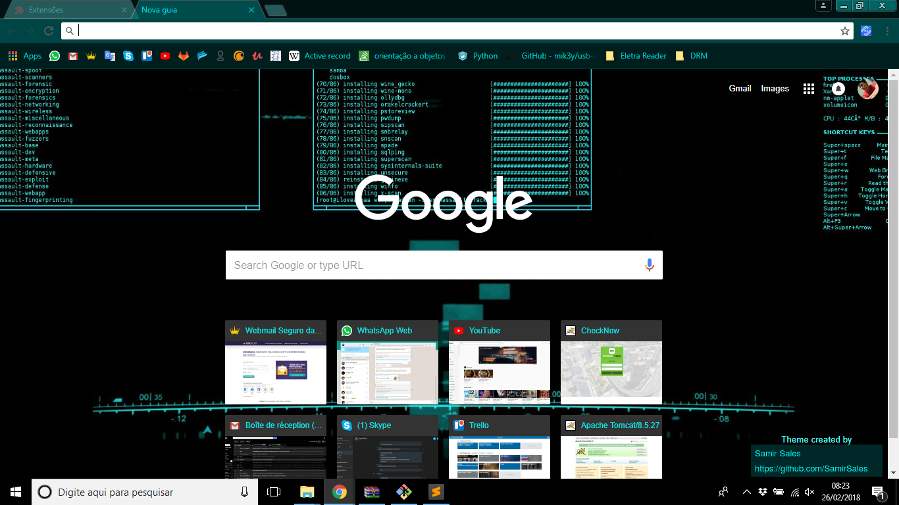

# Jarvis Chrome Theme
It's a Chrome theme that leaves browser graphics look like Jarvis (Tony Stark's computer)

## How to use
1. Download the project
2. Open your Chrome and access the link: _“chrome://extensions”_
3. Enable "Developer Mode"
4. Choose the option to load extension in development.
5. Enjoy!

## Screenshot

